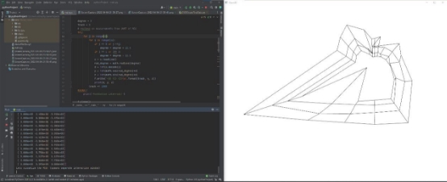
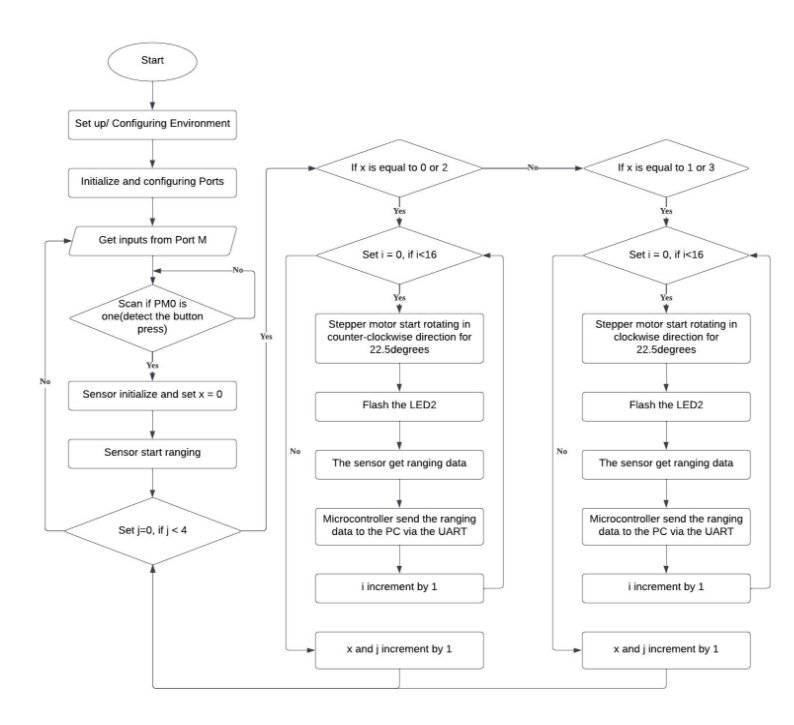
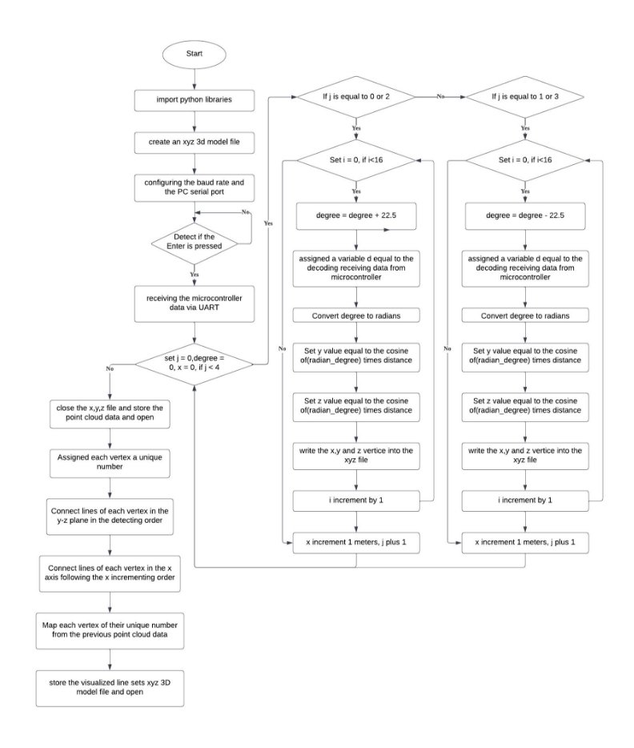

2DX: Microprocessor Systems Project Final Project

Instructor: Drs. Boursalie, Doyle, and Haddara

Rui Qiu – qiur12 - 400318681 - 2DX3 - Tuesday Afternoon - L02

As a future member of the engineering profession, the student is responsible for performing the required work in an honest manner, without plagiarism and cheating. Submitting this work with my name and student number is a statement and understanding that this work is my own and adheres to the Academic Integrity Policy of McMaster University and the Code of Conduct of the Professional Engineers of Ontario. Submitted by **[Rui Qiu, qiur12, 400318681]** 

***Device Overview*** 

The world is presented in three dimensions - a world in which entities can only be measured by length, width, and height. 3D models can be a good representation of the three-dimensional world and provide unparalleled detail and accuracy. Compared with 2D graphics, 3D models can construct real-world and imaginary shapes and display them more intuitively. It provides a level of design depth that 2D designs cannot.[1] What’s more, the Commercial Light Detection and Ranging (LIDAR) equipment is expensive and bulky. As an engineer, seeking the accuracy of physical phenomena while minimizing cost is the ultimate goal. As a result, this device will use a timing-of-flight sensor to acquire the surrounding data. Using a rotary mechanism to provide a 360-degree measurement of distance within a single vertical geometric plane (e.g., y-z). This device will operate at a fixed distance along an orthogonal axis (e.g., x-axis). The mapped y-z information will be stored in onboard memory and communicated to a personal computer. The PC will use a third software application (e.g., python) to construct the acquired information and present a 3D model.[2] 

**Features** 

- Bus Speed: 24Mhz 
- Operating Voltage: VL53L1X ToF sensor - 3.3V; VMA401 Stepper Motor - 5V 
- 1024 KB of flash memory, 256KB of single-cycle system SRAM and 6KB of EEPROM for thee MSP432E401Y MCU; The VL53L1X ToF sensor stores the coordinates in non-volatile memory and are readable through the provided API functions. 
- Two 12-bit ADC modules; ADC channels: 20; 

ADC sampling rate (Msps):2; Sampling frequency is 1/10ms=100Hz 

- VL53L1X Time-of-Flight Distance Sensor: $20.90. MSP432E401Y: $73.40. VMA401 Stepper Motor: $6.95. 
- Language: Embedded C - Microcontroller. Python - Data processing 
- Serial Communication details: The sensor and microcontroller are connected via I2C. The microcontroller and PC are connected via UART. 
- Baud rate:115200bps. 
- Terminator: Hardware - An output high of a peripheral push button or reset, 

`           `PC – Python program keyboard interrupt, end visualization 

**General Description** 

This device is using the Microcontroller MSP432E401Y. It is a low-cost evaluation platform  for  SimpleLink  Arm  Cortex-M4F-based  Ethernet  microcontrollers.  The Ethernet  LaunchPad  development  kit  design  highlights  the  MSP432E401Y microcontroller with its on-chip 10/100 Ethernet MAC and PHY, USB 2.0, hibernation module, motion control pulse-width modulation, and a multitude of simultaneous serial connectivity. It also features two user switches, four user LEDs, up to 40 I/O pins, dedicated reset, and wake switches [3].  

The VL53L1X timing-of-flight sensor (ToF) measures the distance by using LIDAR. The LIDAR is named Light Detection and Ranging, it first emits a tiny pulse of light(940nm). When the light hits an object, it will return back to the sensor. Moreover, it can measure how long it takes for emitted pulses of light to reach the nearest object and reflect back to the detector. The measured distance can be calculated as equal to the (photon travel time/2) \* Speed of light. 

The MSP432E401Y Microcontroller will be used as a link from the sensor to the PC. The sensor will be connected to the GPIO ports of the MCU by wires and transfer the data from the sensor to the controller. The controller will send the received data to the PC for further data processing and visualization. 

The 28BYJ-48 stepper motor is driven by the VMA401-ULN2003 interface board. It is programmable to rotate with precise angles, speed, and directions. By fastening the sensor to the motor rotation rod, the motor will rotate each 22.5degrees and sensor detecting the ranging distance in that rotation angle. The measured distance can be converted into x,y,z coordinates for constructing 3D model by using Python program. 

**Block Diagram** 

*Device Set*  *up  PC Display Screenshot *

*Device Setup* 

***Device Characteristic Table*** 

|**Characteristics** |**Detail** |
| - | - |
|Sensor Weight |0.5 g  |
|Sensor Dimensions |13 mm × 18 mm × 2 mm |
|Sensor Operating Voltage |2.6V to 5.5V |
|Sensor Minimum range |4 cm |
|Sensor Maximum range |400 cm |
|Sensor Detector |16×16 SPAD |
|Sensor output format |16-bit distance reading (in millimeters) |
|Motor dimensions |35 mm × 32 mm × 10 mm |
|Motor diameters |28mm |
|Motor operating frequency |100Hz |
|Motor Operating Voltage |5-12V DC |
|Motor number of phases |4 |
|10kΩ resistor |1 |
|330Ω resistor  |1 |
|Four terminals Push button |1 |
|Sensor Pin connections |3V to 3V3. GND to GND, PB2 to SCL, PB3 to SDA |
|Stepper Motor Connections |5V to 5V, GND to GND, IN1-IN4 to PH0-PH3 |
|Push-button Pin connection |PM0 as input |
|Bus speed |24MHz |
|Baud rate |115200 bps |
|Personal PC Port (may differ) |COM3(may differ) |
|Python special library |pyserial, NumPy, open3d |
***Detailed Description*** 

To measure the planar spatial distance, the VL53L1X Time of Flight (ToF) sensor will be used and predesigned on a breakout board as shown in the picture below. The sensor 

is mounted to a stepper motor following the rotation motion of  the  motor.  As  an  output high from the push button is being  detected,  the  whole system will start working. The microcontroller  will  first initialize  the  sensor  to  get ready for the ranging process, 

as the ranging process finishes. The  stepper  motor  will  start rotating  22.5  degrees  in  a counterclockwise direction 16 

times to finish a one 360 rotation. In each rotation, it will be used Systick\_wait() function to wait for 40ms to finish a series of tasks. The microcontroller will get the ranging  data  (measured  distance)  from  the  sensor  via  I2C  and  communicate  the microcontroller to the PC through UART to allow the PC to print the measured distance in  Python.  This  design  will  perform  four  rotations  in  either  counterclockwise  or clockwise direction to avoid the wire wrapping together during the rotation. There will be a total of 64 ranging data (measured distance) to pass from the sensor through the microcontroller to the PC for each 22.5degrees. The data will be transferred one at a time and it can be visualized in real-time through python. For each data transfer, the python algorithm will be used to convert the measured distance and store them in the data point cloud for future data visualization. 

The circuit schematic of the device can be found[ here. ](#_page12_x87.00_y118.92)

**Distance Measurement** 

The relationship of distance, time and speed can be expressed as the following expression: 

- × ∆ 

The  VL53L1X  is  a  state-of-the-art,  Time-of-Flight  (ToF),  laser-ranging  sensor, enhancing the ST FlightSense™ product family. It is the fastest miniature ToF sensor on the market with accurate ranging up to 4 m and fast ranging frequency up to 50 Hz.[3] 

It uses the time of flight (ToF) of invisible, eye-safe laser pulses to measure absolute distances independent of ambient lighting conditions and target characteristics like color, shape, and texture (though these things will affect the maximum range). The VL53L1X also features a programmable region of interest (ROI), so the full field of view can be reduced or divided into multiple zones.[4] 

The VL53L1X offers three distance modes: short, medium, and long. Short distance is mode is mostly immune to ambient light but limited with the ranging distance which the maximum ranging distance is 1.3m(4.4 ft). This device is going to mainly apply to construct the 3D model of a regular house hallway, to meet most of the hallway ranging distance. 

To successfully measure the distance from the detected object to the sensor. The ToF sensor will emit a pulse of light(940nm) as introduced before from the emitter side. As the light hits the object, it will return back to the sensor. The onboard ranging core will measure the time takes for emitted pulses of light to reach the nearest object and be reflected back to the detector. Based on the relationship of distance, speed and time introduced before, the photon(pulses) travel time from the emitter to the detecting object can be dived by two from the total travelling time and the measured distance can be calculated as the following expression. 

∆

- × 

2

The speed of light is expressed as *c* and is a constant value equal to 299,792,458m/s. 

To  interact  with  the  VL53L1x,  the  manufacturer(ST)  provides  an  application programming interface(API). By correctly configuring the initializing of the sensor by setting API functions on the microcontroller, the distance data will be transferred one at a time after the motor 22.5degrees via I2C. Below is a basic flow chart to use the API. 

Those are mandatory functions needed to be enabled for the microcontroller initialize. 

The microcontroller will communicate through UART by setting the same BAUD rate 115200 on PC. The PC will synchronize the data instantly by using python to decode the measured distance into string format. It is important to notice that the string format need to be converted into integer or float data type to perform the math operation. This can be simply done by using int(measured\_distance). 

To convert the measured distance into spatial distance (y-z plane). The stepper motor 

rotation degree will be used as a reference angle for the measure distance to calculate the y and z coordinates. The formula to calculate y and z within a given angle can be expressed below. 

- cos ( ) ∗ \_
- sin ( ) ∗ \_

The x distance will increment one meters after one motor rotation. The x, y and z coordinates will be all written into the previous created xyz 3D model file for further data visualization. (The flowchart of the microcontroller can be found[ here)](#_page13_x87.00_y103.92). 

Let’s take an example, after the motor rotate 90degrees into the first clockwise direction. The  sensor  is  detecting  an  object  and  calculated  the  distance  is  2000mm.  The microcontroller has finished its sensor initializing and receiving this ranging distance 2000mm. It sends the 2000 to the PC via UART, PC uses the python program to decode the 2000 into the string format and then convert it into integers. The python algorithm will perform cos(90)\*2000 and sin(90)\*2000 to get the y and z coordinates which are y=0, z=2000. Since it is in the first clockwise rotation, x will be set to zero. The xyz(0,0,2000) will be plotted as point in the 3D model file for further data visualization. 

**Visualization** 

This device is being tested on the environment below. (The flowchart for the python program can be found[ here)](#_page14_x87.00_y103.92). 

- Operating System: Windows10 
- Python Version: Python 3.9 
- UART Port: COM3 
- Python libraries required: NumPy, Open3D, Pyserial, math 

The communication to pass the data is being accomplished by installing the third library module-pyserial. By correctly setting the UART Port and the baud rate, the user can receive the data from the microcontroller through python. 

The Opend3D is a good data visualization third party tool for Python. It will allow the user to create and manipulate the 3D model in the xyz file format. 

After the data is being received from the PC and converted into the x,y and z coordinates. The xyz coordinate will be written as a point into the previous created xyz file. Since the data synchronization is real-time, the point will be written one at a time and wait for the next synchronization. After 64 distance measurements and synchronization finished. The xyz point cloud can be load into an Open3D/array. The array can be accessed later for further visualization. 

To visualize the point cloud, the following command can be used.  

o3d.visualization.draw\_geometries([point\_cloud\_array]) (Here is an example of the data point cloud graph) 

To visualize those data points better and construct a 3D model. LineSet() function from the  Open3D  module  can  be  used  to  connect  each  data  points.  To  avoid  directly manipulate the raw distance data, each distance data will be assigned an index number corresponding their original position in the data point cloud. The idea of connecting each point is to connect the plane separately. Firstly, because there are 16 rotations within one cycle, there will be 16 points in the y-z plane within the same x. By following the logic that connect point one to point two and point two to point three by using lines. This will construct a 2D planar graph of the y-z plane. After finish constructing the y-z plane line connections. Their vertices connections between each y-z plane follow the x orthogonal can use the same logic. It is important to notice since the rotation is in counter-clockwise first then into clockwise and following the opposite direction; the assigned first index will be connected to the thirtieth index which is the last vertice of the second rotator motion. And the last index of the first rotation will connect to the first index of the second rotation. 

Each line connections assigned can be used lines.append() to add at the last element of the array. By performing the below command, it will map the lines to 3d coordinate vertices. 

Finally, the finished 3D model can be visualized through the previous command but with a line set parameter. 

o3d.visualization.draw\_geometries([line\_set]) 

Below is a finished example of 3D-constructed model for the hallway. 

*Hallway  Front View Side View*

***Applications*** 

- 3D model construction of hallway 
- Measurement tool under dark environment 
- 3D model constructions for regular house room 
- A surrounding environment detector 
- Geological model mapping 

Here is an application of how this device is acquiring signal and mapping the 3D model. 

1. Place the entire device in the center of the hallway that will be measured.  
1. Set the fixed x value to be 0 for the first measure position and repeat three times for marking every meter directly in front of the device.  
1. Connect  the  microcontroller  to  the  PC  through  the  cable  to  realize  data synchronization. 
1. Push  the button to  give an active high  signal  to the microcontroller and start initializing each port and sensor 
1. Run the previous written python program on the PC and enter space to start data synchronization. 
1. The onboard LED2 will turn on during the initializing 
1. LED D2 stop flashing and stepper motor will start rotating 
1. Stepper motor will start rotating 22.5degrees in the counter-clockwise direction, LED D2 will flash when it finished 22.5degrees rotation 
1. The sensor will get the ranging data and send the data to the microcontroller through I2C. The microcontroller will allow the python to print the ranging data by correctly setting the COM port and baud rate. 
1. Python program will convert the distance data and store them into an xyz file. 
1. Step 7 to 9 will repeat 16times to allow the sensor finish acquiring the current planar data and store them in the xyz file. 
1. Moving the device into previous defined x coordinate. The x should increment 1m per direction. 
1. The step 7 to 9 will repeat 16 times again but in the rotation opposite direction. 
1. The step 7 to 14 will repeat again to acquire more distances data. 
1. After 64 distance measurements has been finished, the stepper motor will stop rotating. The python program will store those coordinates from the xyz into an array. 
1. Python program will show a 3D data point cloud graph. 
1. Assigned an index of each coordinate. 
1. Connect each plane of vertices by lines. (By correctly connecting each vertice following the detecting order.) 
1. Connect vertices between planes. (By correctly connecting each vertice following the  same  detecting  angle  position  order)  [More  detailed  is  shown  in  the [Visualization\]](#_page6_x87.00_y352.92). 
1. Using linset() function to map the lines to the 3D coordinates vertices. 
1. Python program will show a 3D model of the hallway. 

[A finished 3D model graph can be found under the[ Visualization.](#_page6_x87.00_y352.92)] 

***User Quick Guide  ***

1. Plug in the micro-c cable to microcontroller  and USB-A cable to the PC. 
1. Check there is only one status LED besides   the chip is on.  
1. Click the reset button beside the micro-c port.  
1. Put the device into the center of the place you want to measure. 
1. Edit the provided Python Program through IDLE. (You need to use Python version 3.6-3.9 to use the Open3D, a supported python version can be downloaded from [https://www.python.org/downloads/release/python-3911/ ](https://www.python.org/downloads/release/python-3911/)) 
1. To check the python installed correctly, go to CMD and type python. You should see this below message is shown.  

7. Type exit () command to exit the python. Type - pip install numpy - into the command. 

The following message should show successfully 

8. Type - pip install pyserial – into command. 

\- pip install open3D – into command.  The installed successfully message should show for both commands. 

9. The Python environment is setup successfully. 
9. Find the user person computer port.  
9. Open device Manager.  
9. Under Ports(COM & LPT).  
9. Find the XDS110 User UART.  
9. Write down the port number besides the UART. (Each PC can differ) 
9. Go to the python program line 17, change the Port number for your personal PC. 

16. Check if the baudrate is setting to 115200 as same as the MSP432E401Y MCU. 
16. Run the python program and you should see the following message. 

18. Push the button once and the LED D2 will turn on to initialize the ports and sensor. 
18. Press Enter on Python program to start communication. 
18. After five seconds, you should see from the python program that ranging data is being synchronized one at a time and   print as shown.   
18. The stepper motor will flash the LED   D2 for each 22.5 rotation.  
18. After 16 distance synchronization, the device will wait for 10seconds to change the x position by 1meters. (The x distance needs to be changed by hands which means you need to mark the predefined x locations and move the device into the next location after one rotation.) 
18. The device will store 64 distance measurements within four axis and require three x positions changes manipulated by hands. 
18. Python program will show the data point cloud graph. 
18. Exit the data point cloud graph and you should see a 3D model. You can drag the 3D model to get the best viewing angles of the hallway. An example of a 3D model is shown below. 

An example of 3D constructed hallway

***Limitations*** 

1) The Cortex-M4F Floating-Point Unit (FPU) can fully support **single-precision** add, subtract, multiply, divide, multiply and accumulate, and square root operations. t also provides conversions between fixed-point and floating-point data formats, and floating-point constant instructions. The FPU provides floating-point computation functionality that is compliant with the ANSI/IEEE Std 754-2008, IEEE Standard for Binary Floating-Point Arithmetic, referred to as the IEEE 754 standard. The FPU's single-precision extension registers can also be accessed as 16 doubleword registers  for  load,  store,  and  move  operations.[5]  The  microcontroller  is  also capable to support trigonometric functions, but it is important to notice both the trigonometric calculation of microcontroller and python required the degree convert to radians. This can be done by using the formula. 
- ×

180

Or directly using the math module from python to convert – *math.radians(degree).* 

However, there is a limitation that the microcontroller is performing the single- precision  instead  of  double-precision  that  python  used.  That  means  when  the precision calculation is required, using python will get a more precise result than the FPU unit which is the reason all the trigonometric calculations is performed in python program for this device. 

2) The maximum quantization error of the ToF module is equal to the ADC resolution. Therefore, the answer can be calculated as follow. 

3.5

- =  = = 8.54 × 10−4
  2  212
3) The maximum standard serial communication rate to implement with the PC is 128000 bits per second. This can be verified in the device manager -> Ports -> User UART (COM3,may differ) -> Right Click -> Properties -> Port Settings -> Bits per second. The default is 9600 bits per second, but the user can select up to 128000bps. 
3) The microcontroller and the ToF modules are using I2C communication method to realize data transfer. The I2C bus on the VL53L1X has a maximum speed of 400 kbits/s and uses a device address of 0x52. 
3) The primary limitation on speed is the stepper motor. The operating frequency of the VMA401 under the reference manual is 100 Hz. As a result, to allow the motor functionally rotate, the time of delay can be calculated as the following expression. 1 1
- = = = 0.01 = 10

100

That is the reason we need set the SystickWait10ms() function is equal to the 10ms. To test the delay, we can use SystickWait10ms(1) to generate a time delay on a Port, by  connecting  the  positive  terminal  of  oscilloscope  to  that  Port  and  negative terminal to the ground. The period of each square waveform should equal to 10ms. 

***Circuit Schematic*** 

***References*** 

1. “4 reasons 3D modeling software is important in design,” Fusion 360 Blog, 29-Nov-2021. [Online]. Available: https://www.autodesk.com/products/fusion-360/blog/3d-modeling - software-design-process-benefits/. [Accessed: 11-Apr-2022].  
1. COMPENG 2DX3, 2021\_2022\_2DX3\_2DX4\_Project\_Specificatio, McMaster University, 2022
1. COMPENG 2DX3, MSP432E401Y - Microcontroller Data Sheet, [pg.1] McMaster University, 2022
1. “Pololu - VL53L1X time-of-flight distance sensor carrier with voltage regulator, 400cm max,” Pololu Robotics & Electronics. [Online]. Available: https://www.pololu.com/product/3415. [Accessed: 11-Apr-2022].  
1. COMPENG 2DX3, MSP432E4 SimpleLink Microcontrollers - Technical Reference Manual, [pg.128] McMaster University, 2022

***Flowcharts*** 

**Microcontroller **

**Python Program**  

